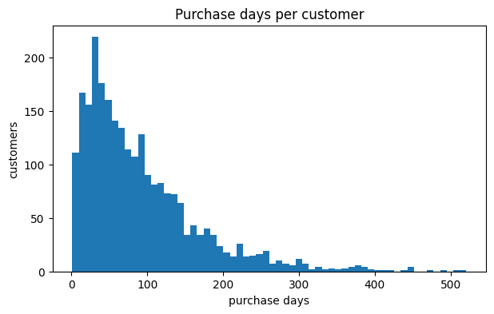
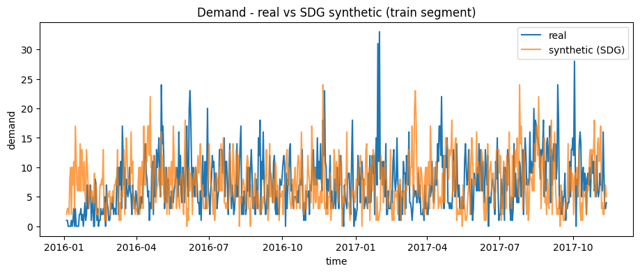
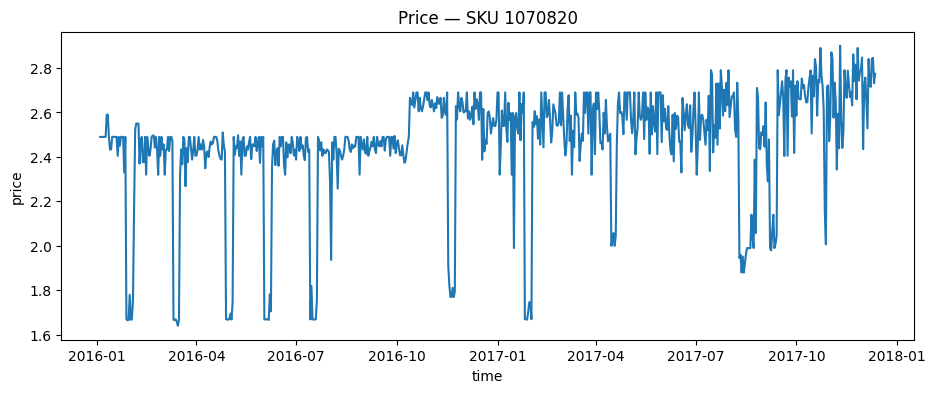
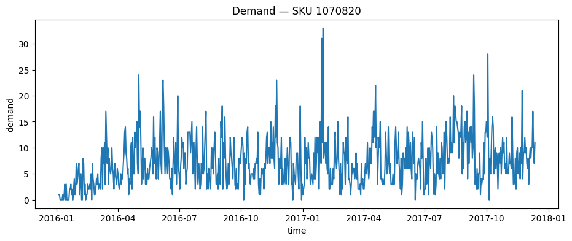
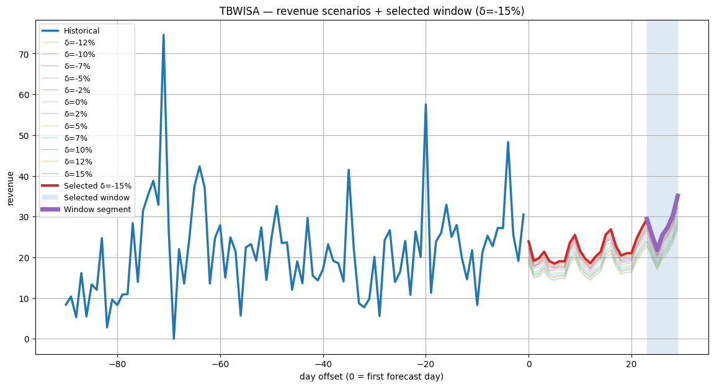
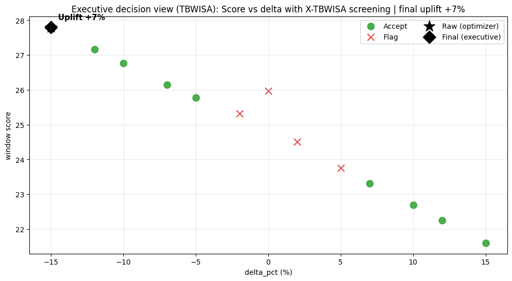

# DIF‑PI — Decision Intelligence Framework for Predicting Purchase Intentions in e‑Commerce

This repository contains the research code, notebooks, and artifacts accompanying the PhD thesis:

> **Decision Intelligence Framework for Predicting Purchase Intentions in e‑commerce**  
> *PhD student:* Alexandru Grigoraș · *Scientific coordinator:* Prof. Dr. Eng. Florin Leon  
> “Gheorghe Asachi” Technical University of Iași — Faculty of Automatic Control and Computer Engineering

DIF‑PI operationalizes a **decision intelligence pipeline** that moves from *prediction* (**when** a purchase is likely) to *prescription* (**what** pricing action to take, **when**, and with what risk flags) with the following modules:

- **Purchase intention / timing** (*NPD*) — *when* customers are likely to purchase next
- **Synthetic data generation** (*SDG*) — optional robustness for sparse or intermittent time series
- **What‑if pricing** (*TBWISA*) — simulate price interventions using SCM‑inspired elasticity and stochasticity
- **Demand forecasting** — global Transformer forecaster for scenario roll‑out
- **Window optimization** — select a revenue‑maximizing execution window
- **Explainability screening** (*X‑TBWISA*) — surrogate and SHAP diagnostics to flag unstable or implausible decisions


## Quickstart

> **Recommended path:** EDA on dataset → Train global forecaster → Run DIF‑PI executive demo.

1) **Build DIF‑PI processed inputs**
   Run: `eda-complete-journey.ipynb`  
   Exports to: `datasets/processed/`

2) **Train the global scenario forecaster** 
   Run: `train-forecaster.ipynb`  
   Saves to: `artifacts/models/scenario_gen_transformer_global/`

3) **Run the end‑to‑end executive demo**  
   Run: `dif-pi.ipynb`  
   Writes decision artifacts to: `artifacts/difpi_exec_demo/`


## Repository structure

```text
DIF-PI/
├── artifacts/
│   ├── difpi_exec_demo/                      # exported decisions
│   ├── models/
│   └   └── scenario_gen_transformer_global/  # global transformer
├── datasets/
│   ├── raw/                                  # place raw exports here
│   └── processed/                            # EDA outputs used by notebooks
├── src/
│   ├── loglinear_scenarios.py
│   ├── npd.py
│   ├── tbwisa.py
│   ├── transformer_forecaster.py
│   └── xgboost_scenarios.py
├── dif-pi.ipynb
├── eda-complete-journey.ipynb
├── train-forecaster.ipynb
├── LICENSE
└── README.md
```


## DIF‑PI framework

DIF‑PI is structured as a **predict → simulate → forecast → optimize → screen → export** pipeline:

1. **Data unification**  
   Convert raw transactions into a daily SKU panel with aligned `timestamp`, `price`, `demand`.

2. **Purchase intention modeling**  
   Estimate *when* the next purchase is likely (customer-level timing).  
   In DIF‑PI, this is used as a decision context signal to interpret “window urgency” and timing.

3. **What‑if pricing scenario generation**  
   Generate counterfactual demand trajectories under price interventions δ using:
   - **TBWISA**
   - **Log‑linear baseline**
   - **XGBoost baseline**

4. **Demand forecasting**  
   Roll out each scenario using a global Transformer forecaster trained across SKUs from the train set.

5. **Revenue window optimization**  
   For each δ, compute revenue = price × forecasted_demand and search for the best execution window using a score that balances revenue and demand constraints.

6. **Explainability screening**  
   X-TBWISA: Train a surrogate to approximate the forecaster’s response over interventions and apply SHAP diagnostics and behavioral checks to label decisions as:
   - **Accept**
   - **Accept_Caution**
   - **Flag**

7. **Executive export**  
   Persist results as CSV/JSON for dashboards and paper appendices.

### Mapping to repo assets

| DIF‑PI stage | Notebook / Module |
|---|---|
| Data unification + exports | `eda-complete-journey.ipynb` |
| Purchase intention (NPD) | `dif-pi.ipynb`, `src/npd.py` |
| Global forecasting training | `train-forecaster.ipynb`, `src/transformer_forecaster.py` |
| End‑to‑end decision run | `dif-pi.ipynb` |
| TBWISA scenario generation | `src/tbwisa.py` |
| Baselines | `src/loglinear_scenarios.py`, `src/xgboost_scenarios.py` |
| Window scoring/selection | `src/tbwisa.py` + `dif-pi.ipynb` |
| Explainability screening | `dif-pi.ipynb` |


## Core components

### 1) Data unification
`eda-complete-journey.ipynb` converts raw transactions into a daily SKU panel with aligned `timestamp`, `price`, `demand`, and exports:

- `datasets/processed/difpi_transactions.csv`  
- `datasets/processed/difpi_pricing_demand.csv`  
- `datasets/processed/difpi_pricing_demand_panel.csv`  
- `datasets/processed/top_skus.csv`  
- `datasets/processed/difpi_metadata.json`

**Daily aggregation (per SKU $s$ and day $t$)**  
Let $\mathcal{T}(s,t)$ be the set of transactions for SKU $s$ on day $t$, with quantity $q_i$ and unit price $p_i$:

- **Demand (units):**
$$
Q_{s,t} = \sum_{i\in \mathcal{T}(s,t)} q_i
$$

- **Price (quantity-weighted unit price):**
$$
P_{s,t} =
\begin{cases}
\frac{\sum_{i\in \mathcal{T}(s,t)} p_i q_i}{\sum_{i\in \mathcal{T}(s,t)} q_i}, & \sum q_i > 0 \\
\frac{1}{|\mathcal{T}(s,t)|}\sum_{i\in \mathcal{T}(s,t)} p_i, & \text{otherwise}
\end{cases}
$$

**Continuity assumptions used by the pipeline**
- The panel is reindexed to **daily continuity** between the first and last observed day.
- Missing demand is set to $0$ (no sales).
- Missing price is forward-filled ($P_{s,t} \leftarrow P_{s,t-1}$) to keep a usable price reference for interventions.

---

### 2) Purchase intention: Next Purchase Day
DIF‑PI uses Next Purchase Day **(NPD)** as a *timing or purchase-intention* signal (decision context, not causal).

**Supervised formulation**  
For each customer $c$ with purchase dates $(d_1, d_2, \dots, d_n)$, define inter-purchase gaps (in days):
$$
g_i = d_{i+1} - d_i,\quad i=1,\dots,n-1
$$

Given a history length $k$, NPD builds supervised samples:
$$
\mathbf{x}_i = [g_{i-k}, \dots, g_{i-1}],\qquad y_i = g_i
$$
Any regressor can be used, as the module is model-agnostic: fit $\hat g = f(\mathbf{x})$.

**Purchase intention index (next $H$ days)**  
For each customer, predict the next gap $\hat g_c$ and map it to a predicted purchase day:
$$
\hat d_c = d_{\max} + \mathrm{round}(\hat g_c)
$$
Count predicted purchases per future day and normalize to $[0,1]$ to obtain an intention index over the horizon.

**Reliability gate (MAE $\rightarrow$ timing weight)**  
NPD error is summarized as MAE (in days), and converted to a timing influence weight $\alpha$:
- MAE $\le$ `good` $\Rightarrow \alpha=\alpha_\text{good}$
- `good` $<$ MAE $\le$ `ok` $\Rightarrow \alpha=\alpha_\text{ok}$
- MAE $>$ `ok` $\Rightarrow \alpha=0$ (disable timing influence)

Operationally, $\alpha$ controls how strongly NPD can justify window timing decisions.

---

### 3) What‑if scenario generation: TBWISA
`src/tbwisa.py` implements TBWISA as an SCM-inspired elasticity and residual model, plus controlled stochasticity.

#### 3.1 Elasticity model
TBWISA uses a log-log demand model:
$$
\log Q_t = \beta_0 + \varepsilon \log P_t + u_t
$$
where $\varepsilon$ is the price elasticity and $u_t$ are residuals (kept for reconstruction).

#### 3.2 Controlled elasticity
When enabled (`configure_controlled_elasticity`), TBWISA fits a robust regression with controls:
$$
\log Q_t = \beta_0 + \varepsilon \log P_t + \gamma^\top \mathbf{z}_t + e_t
$$
Typical controls $\mathbf{z}_t$ include:
- trend (z-scored time index),
- Fourier seasonality terms (e.g., weekly / yearly),
- lagged log-demand $\log Q_{t-1}$.

To reduce identifiability issues, the fit can be restricted to **price-change events**:
$$
|\log P_t - \log P_{t-1}| \ge \log(1+\tau)
$$
where $\tau$ is a price-change threshold. A non-positive prior is enforced ($\varepsilon \le -\epsilon_\text{prior}$), and an optional magnitude cap can be applied.

#### 3.3 Counterfactual under a price intervention
For an intervention $\delta$ (%), define:
$$
P_t^{(\delta)} = P_t\left(1+\frac{\delta}{100}\right)
$$

TBWISA reconstructs counterfactual demand by reusing the fitted residuals:
$$
\hat Q_t^{(\delta)} =
\exp\left(\beta_0 + \varepsilon_\delta \log P_t^{(\delta)} + u_t\right)
$$

Non-linear elasticity shaping adjusts:
$$
\varepsilon_\delta = \varepsilon\left(1 + 0.5\left(\frac{\delta}{100}\right)^2\right)
$$

#### 3.4 Controlled stochasticity
To avoid brittle single-trajectory decisions, TBWISA applies a capped multiplicative shock:
$$
Q_{t,\text{stoch}}^{(\delta)} = \hat Q_t^{(\delta)}\left(1 + \eta_t\right),
\quad
\eta_t \sim \mathcal{N}\!\left(0,\,\sigma|\delta|\right),\ \eta_t \in [-c,c]
$$

---

### 4) Global Transformer forecaster
`src/transformer_forecaster.py` trains a single **global** Transformer on pooled windows across many SKUs.

**Windowed training objective**  
Let $y_t$ be demand. With sequence length $L$, form windows:
$$
\mathbf{x}_t = [y_{t-L},\dots,y_{t-1}],\qquad y_t\ \text{target}
$$
The model learns $f_\theta(\mathbf{x}_t)\approx y_t$ by minimizing a robust loss (using Huber).

**Multi-step forecasting**  
Given the last $L$ observations, DIF‑PI rolls forward autoregressively:
$$
\hat y_{t+1}=f_\theta([y_{t-L+1},\dots,y_t]),\quad
\hat y_{t+h}=f_\theta([\hat y_{t+h-L},\dots,\hat y_{t+h-1}])
$$

Scaling is applied per SKU at inference time to avoid leakage.

---

### 5) Optimal profit window search
For each intervention $\delta$, DIF‑PI computes forecast revenue:
$$
R_t^{(\delta)} = P_t^{(\delta)} \cdot \hat Q_t^{(\delta)}
$$

For a candidate window starting at offset $s$ with length $\ell$ (within $\ell\in[\ell_{\min},\ell_{\max}]$), the average revenue is:
$$
\bar R_{s,\ell}^{(\delta)}=\frac{1}{\ell}\sum_{t=s}^{s+\ell-1} R_t^{(\delta)}
$$

The window score follows the implementation:
$$
\text{score}(s,\ell)=\bar R_{s,\ell}^{(\delta)} - \lambda \ell
$$
where $\lambda$ is an optional length penalty. The selected window is:
$$
(s^{*},\ell^{*})=\arg\max_{s,\ell}\ \text{score}(s,\ell)
$$

---

### 6) X‑TBWISA screening
Screening is a behavioral consistency check applied before executive export:

1) **Surrogate fidelity:** fit a surrogate $\hat f$ to approximate the teacher (Transformer) response over the intervention grid and report:
$$
\mathrm{MAE}=\frac{1}{N}\sum_{i=1}^{N}\left|\hat y^{(\text{teacher})}_i-\hat y^{(\text{surrogate})}_i\right|,
\quad
\mathrm{RMSE}=\sqrt{\frac{1}{N}\sum_{i=1}^{N}\left(\hat y^{(\text{teacher})}_i-\hat y^{(\text{surrogate})}_i\right)^2}
$$

2) **SHAP diagnostics:** compute SHAP values on the surrogate to detect explanation drift across $\delta$ (tagged as `high_shap_drift` when unstable).

3) **Economic plausibility checks:** enforce basic intervention coherence (implausible response patterns across $\delta$ are tagged as `economic_plausibility_fail`).

The output is a screening label (**Accept / Accept_Caution / Flag**) plus a reason tag, used to downgrade risky actions before the final executive recommendation.

---

### 7) Synthetic data generation (SDG)
SDG is used to improve the pipeline under sparse or intermittent demand data:
- generate distributionally plausible synthetic demand segments,
- train/validate forecaster under real-only vs real + synthetic,
- report both forecast metrics and decision stability (recommended $\delta$ consistency).


## Key defaults

- **Eligibility mode:** `adaptive`, `strict`, `relaxed`
- **Delta grid (δ):** `[-15, -10, -5, 0, 5, 10, 15]` (percent price interventions)  
- **Forecast horizon:** `30 days`
- **Global model location:** `REPO_ROOT` / 'artifacts' / 'models' / 'scenario_gen_transformer_global'  
- **Exports:** `REPO_ROOT` / 'artifacts' / 'difpi_exec_demo'


## Outputs

Running `dif-pi.ipynb` writes:

- `decision_table_case_sku_<SKU>.csv` — ranked decisions
- `decision_table_screened_case_sku_<SKU>.csv` — ranked decisions + screening labels
- `metrics_case_sku_<SKU>.csv` — per-delta summary metrics
- `windows_case_sku_<SKU>.csv` — optimal window candidates per delta
- `shap_global_importance_case_sku_<SKU>.csv` — surrogate global SHAP importance
- `executive_summary_case_sku_<SKU>.json` — compact “decision card” for dashboards

All under: `artifacts/difpi_exec_demo/`.


## Experiments


### Experiment gallery (key figures)

> **Note:** The results and figures below are generated by `dif-pi.ipynb`. 

#### E1 — Purchase intention distribution (NPD signal)
This histogram summarizes purchase days per customer. It motivates the NPD layer: customers exhibit strong heterogeneity and a long tail, so DIF‑PI treats NPD as a timing signal and
down‑weights it when error is high, as a reliability gate.



**How to interpret and use**
- The long-tail distribution indicates strong heterogeneity in shopping frequency, many infrequent buyers.
- Use this as justification for timing-aware decisions: DIF‑PI can align actions to periods with higher predicted purchase activity, but will down-weight timing when NPD is unreliable.
- Operationally, this plot supports whether to treat the upcoming horizon as “high intent” vs “low intent” for planning the intervention window.


#### E2 — Synthetic data generation (SDG)
This plot compares real demand vs SDG synthetic demand on the same training segment.
The purpose is not perfect matching, but distributional plausibility (spikes, volatility, seasonality proxy) to support robustness experiments (real‑only vs real+synthetic training).



**How to interpret and use**
- If the synthetic series matches key stylized facts (volatility, spikes, rough seasonality), it is suitable for robustness testing.
- Use SDG to compare real-only vs real + synthetic forecaster training, then report both forecast error changes and decision stability (recommended $\delta$ consistency).


#### E3 — Price/demand visualization for a representative SKU (SKU 1070820)
This is a lightweight , paper‑grade check that the SKU panel is aligned and economically plausible.




**What to report**
- date range, number of observations, missingness rate
- a short qualitative observation (e.g., “promotional price drops coincide with demand spikes”)

#### E4 — TBWISA what‑if scenarios + selected window
This figure shows forecasted revenue trajectories under a grid of price interventions $\delta$,
with the selected optimal window highlighted. It visualizes the prescriptive logic:
generate scenarios → forecast demand → compute revenue → select best execution window.



**How to interpret and use**
- Each curve is the forecasted revenue trajectory under a candidate intervention $\delta$.
- The highlighted segment is the selected optimal execution window $(s^{*},\ell^{*})$ for the chosen $\delta$.
- Implementation: apply the chosen $\delta$ for $\ell^{*}$ days starting at offset $s^{*}$ (relative to the decision date), and use X‑TBWISA screening to decide EXECUTE vs PILOT vs REVIEW.


#### E5 — Executive decision view
This figure summarizes the final decision logic: window score vs delta.
- Green points: deltas that pass screening (Accept)  
- Red points: deltas flagged by X‑TBWISA (Flag)  
- Black star: raw optimizer pick (best score before screening and guardrails)  
- Black diamond: final executive pick (after screening and guardrails; aligns with the exported decision card)



**Interpretation**
- Screening can override the raw optimum when the response is unstable or implausible.
- The final executive recommendation is exported in `executive_summary_case_sku_<SKU>.json`.


## Executive decision outcome (final recommendation)

For executives / deployment, DIF‑PI exports a single **decision card**:

- `artifacts/difpi_exec_demo/executive_summary_case_sku_<SKU>.json`

This JSON contains the **final recommendation** after screening + guardrails (and, when enabled, NPD-based timing adjustment).

### Example: executive decision card

```json
{
  "case_sku": "1070820",
  "forecast_backend": "scenario_gen_transformer_global",
  "npd_mae_days": 1.078113866446046,
  "horizon_days": 30,
  "recommendation": {
    "model": "tbwisa",
    "forecast_backend": "scenario_gen_transformer_global",
    "recommended_delta_pct": -15,
    "window_start_offset_days": 23,
    "window_length_days": 7,
    "avg_rev_forecast": 23.14267851303652,
    "baseline_avg_rev": 21.462066568588508,
    "uplift_ratio": 0.07830615653897083,
    "window_score": 27.80628383928755,
    "x_tbwisa_status": "Accept",
    "x_tbwisa_reason": "ok"
  }
}
```


**How to read it**
- `recommended_delta_pct` + `window_*` define **what** to do and **when** (relative to the decision date).
- `x_tbwisa_status` is the screening label (**Accept / Accept_Caution / Flag**).
- `primary_action` is the operational directive (e.g., **EXECUTE**, **PILOT**, **REVIEW_REQUIRED**).  
  DIF‑PI may downgrade Accept → Accept_Caution when elasticity is unreliable or uplift is extreme, to reduce decision risk.


## Setup

### Python
Python **3.10+** recommended.

### Suggested dependencies
The notebooks use:
- numpy, pandas, scipy
- scikit‑learn
- xgboost
- statsmodels
- tensorflow (2.x)
- shap
- matplotlib

Example install:
```bash
python -m venv .venv
source .venv/bin/activate  # Windows: .venv\Scripts\activate
python -m pip install --upgrade pip
python -m pip install numpy pandas scipy scikit-learn xgboost statsmodels tensorflow shap matplotlib joblib
```

### Notebook import convention
Notebooks import from `src/` (run from repo root):
```python
from src.tbwisa import TBWISAGenerator
from src.npd import NPDModel
from src.transformer_forecaster import ScenarioGenerationTransformerForecaster
```


## Data

Raw datasets are **not committed** due to licensing or size.

### dunnhumby “The Complete Journey”

Download dataset from [dunnhumby.com](https://www.dunnhumby.com/source-files/)

Place your export under:
```text
datasets/raw/complete_journey/
```

Then run `eda-complete-journey.ipynb` to generate the DIF‑PI inputs in `datasets/processed/`.


## Reproducibility notes

- Fixed seeds are used where possible.
- `train-forecaster.ipynb` writes train/test SKU lists next to the saved model.
- DIF‑PI includes decision guardrails to downgrade risky actions (e.g., extreme elasticity / uplift).


## Citation

### Thesis
```bibtex
@phdthesis{grigoras_difpi_thesis_2026,
  title  = {Decision Intelligence Framework for Predicting Purchase Intentions in e-commerce},
  author = {Grigoras, Alexandru},
  school = {''Gheorghe Asachi'' Technical University of Iasi},
  year   = {2026},
  note   = {Code and notebooks available in this repository.}
}
```


# Publications

The thesis integrates and extends four research components:

1) [**Synthetic Time Series Generation for Decision Intelligence Using Large Language Models**](https://www.mdpi.com/2227-7390/12/16/2494) (SDG module)  
2) [**Transformer‑Based Model for Predicting Customers’ Next Purchase Day in e‑Commerce**](https://www.mdpi.com/2079-3197/11/11/210) (NPD module)  
3) [**Generating and Optimizing What‑If Scenarios Using a Transformers‑Based Forecasting Model**](https://ieeexplore.ieee.org/document/11240464) (TBWISA module)  
4) **X‑TBWISA: Explainable What‑If Scenario Generation Using Transformers and SHAP Guidance** (explainability / screening layer)


## License
MIT License — see `LICENSE`.
